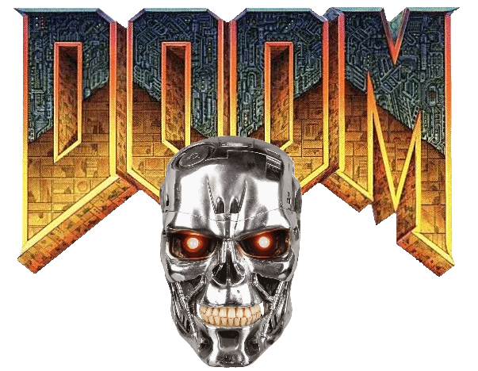

    

 

Doominator (a portmanteau of "Doom" and "Terminator") is a reinforcement learning agent trained to play Doom. It is a research project aimed at creating a powerful and efficient agent that can be used to play any scenario in Doom (more specifically, the ViZDoom research platform).