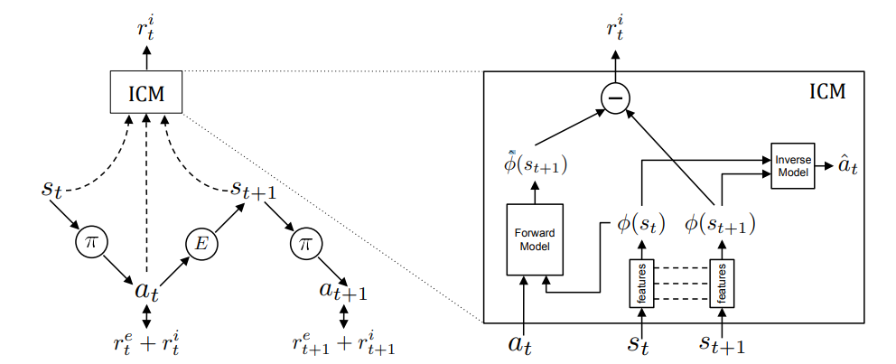

    

 

Doominator (a portmanteau of "Doom" and "Terminator") is a reinforcement learning agent trained to play the game Doom through the ViZDoom research platform. It is an independent research project aimed at creating an efficient agent that can solve any scenario in the game.

# Implementation
Much of the code comes from [Tianshou's ViZDoom example](https://github.com/thu-ml/tianshou/tree/master/examples/vizdoom). In essence, Doominator is guided by the joint usage of Proximal Policy Optimization (PPO) and Intrinsic Curiosity Module (commonly known as ICM), which I personally deem the real star of this project.

 

 *Intrinsic Curiosity Module, taken from the <a href="https://pathak22.github.io/noreward-rl/resources/icml17.pdf">paper</a>. As an agent in a certain state executes an action, sampled from its current policy, in the environment, the ICM encodes the current and future states into features, which are used to predict the current action; simultanously, the forward model uses the current action and the feature that corresponds to the current state to predict the next state. The prediction error that arises from these calculations are used as the curiosity-based intrinsic reward signal.*

 

When it comes to ViZDoom scenarios, the agent will behave similarly to what is described in the image: it will take actions based on the current state, and will learn from the experience of the previous state and the current state. The ICM will assist the agent in learning the correct action to take, and will be pivotal in environments that possess sparse or non-existing rewards (e.g., "MyWayHome").

# References
* [Curiosity-driven Exploration by Self-supervised Prediction](https://pathak22.github.io/noreward-rl/resources/icml17.pdf)
* [Proximal Policy Optimization](https://arxiv.org/abs/1707.06347)
* [ViZDoom repository](https://github.com/mwydmuch/ViZDoom)
* [Tianshou repository](https://github.com/thu-ml/tianshou)
